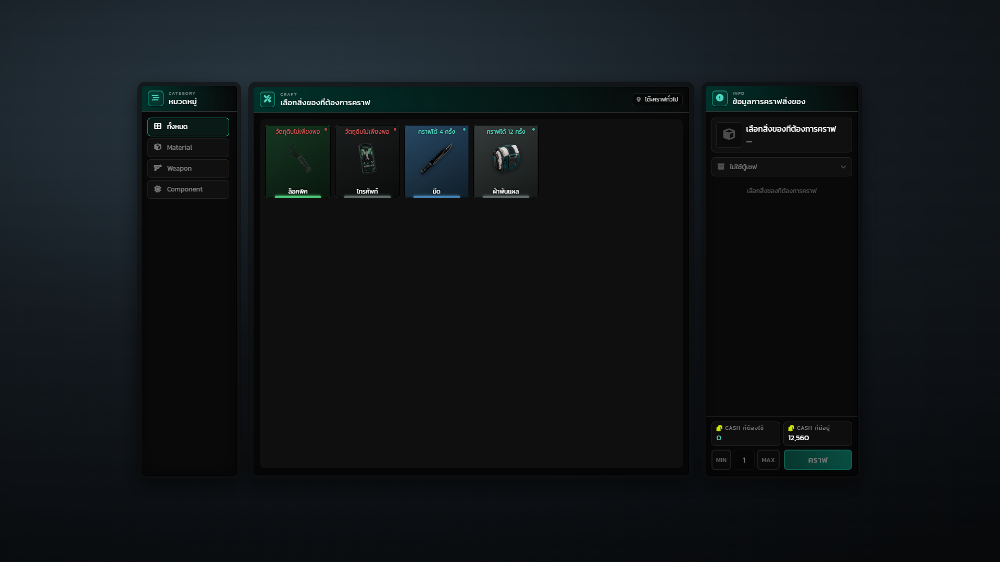

# Hyper_Crafting

ระบบคราฟและอัปเกรดไอเทมสำหรับเซิร์ฟเวอร์ FiveM ผู้เล่นเดินไปที่โต๊ะในแผนที่ กด **E** แล้วเลือกสูตรที่อยากทำ ระบบจะหักวัตถุดิบกับเงิน จับเวลา สุ่มว่าสำเร็จหรือไม่ แล้วส่งของเข้ากระเป๋าให้ — ทุกขั้นตอนตัดสินที่ฝั่งเซิร์ฟเวอร์ ไคลเอนต์เป็นแค่หน้าจอ

## ข้อมูลทั่วไป

| หัวข้อ | ค่า |
|---|---|
| เวอร์ชัน | 0.2.0 |
| เฟรมเวิร์ก | ESX (แยก adapter ไว้ที่ `config/framework/esx/`) |
| Dependency | `Hyper_Notifyall` (แจ้งเตือน + Text UI) |
| เชื่อมต่อเพิ่ม | `Hyper_Inventory` · `Hyper_Vault` · `Hyper_Discordlogs` · `Hyper_Check` |
| NUI | `html/ui.html` — สองหน้าจอ (คราฟ / อัปเกรด) |
| ธีมสี | 7 ธีม เลือกด้วย `Config.Theme` |
| ขนาดโค้ด | 7,180 บรรทัด (Lua 2,426 · JS 1,740 · CSS 2,687 · HTML 327) |

## โต๊ะที่ตั้งไว้ให้แล้ว

| โต๊ะ | ชนิด | หมวดที่เปิด | พิกัด |
|---|---|---|---|
| โต๊ะคราฟทั่วไป | `craft` | Material · Component | `964.78, -3184.13, 13.40` |
| โต๊ะคราฟอาวุธ | `craft` | Weapon | `968.30, -3196.40, 13.40` |
| โต๊ะอัพเกรด | `upgrade` | ทุกหมวด | `972.00, -3190.00, 13.40` |

เพิ่ม/ย้ายโต๊ะได้ที่ [`config/config.tables.lua`](config.md#โต๊ะและจุดวาง)

## เริ่มใช้งาน

1. วางโฟลเดอร์ใน `resources` แล้ว `ensure Hyper_Crafting` ใน `server.cfg`
2. ตั้งเว็บฮุก Discord (ถ้าต้องการ log) ใน `server.cfg`:
   `set hyper_crafting_webhook "https://discord.com/api/webhooks/..."`
3. แก้สูตรที่ `config/config.craft.lua` และจุดโต๊ะที่ `config/config.tables.lua`

ไม่ต้อง import ฐานข้อมูล ระบบนี้ไม่เก็บอะไรลง DB

## ลัดไปหน้าที่ต้องการ

* [ฟีเจอร์ทั้งหมด](features.md) — ทำอะไรได้บ้าง พร้อมค่าที่คุมแต่ละอย่าง
* [การตั้งค่า](config.md) — ไฟล์ config ทุกตัวและค่าที่ปรับบ่อย
* [หน้าจอ UI](ui-screens.md) — ภาพทุกโหมดพร้อมคำอธิบาย
* [ธีมสี](themes.md) — 7 ธีมและสิ่งที่เปลี่ยนตามธีม
* [เทคโนโลยี](technology.md) — ลำดับการทำงานและการป้องกันการโกง
* [การเชื่อมต่อ](export/README.md) — export ของ resource อื่นที่ระบบนี้เรียกใช้
