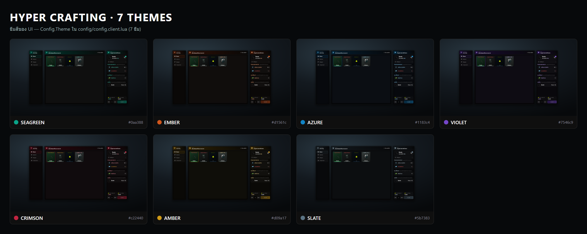
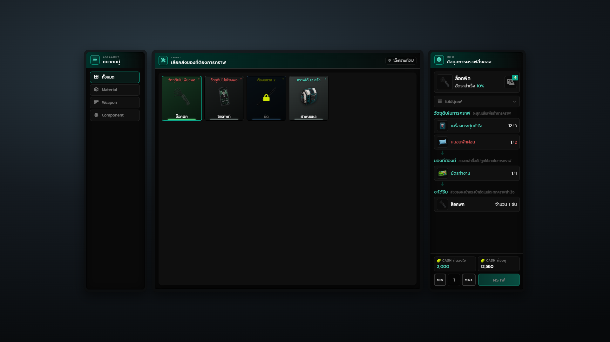
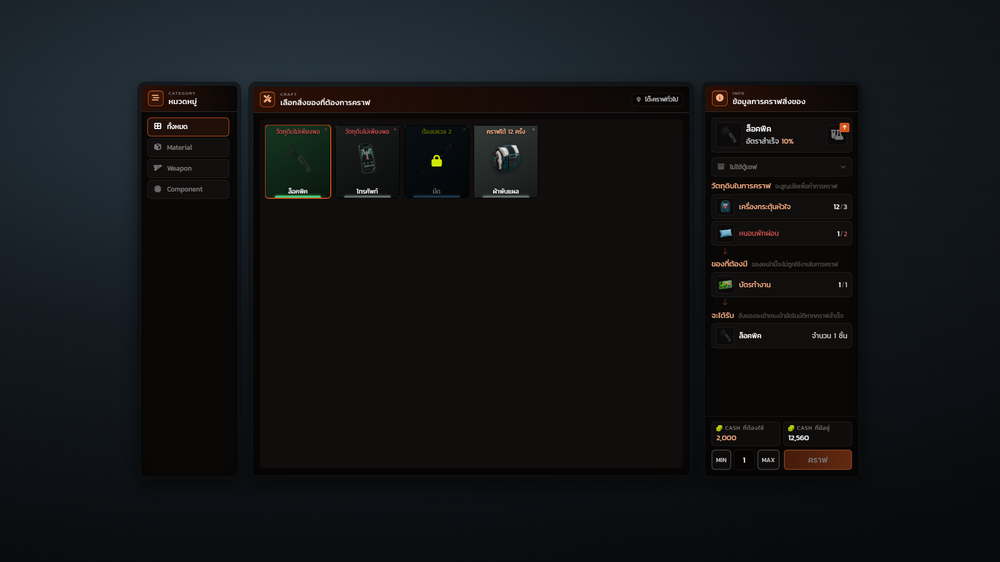
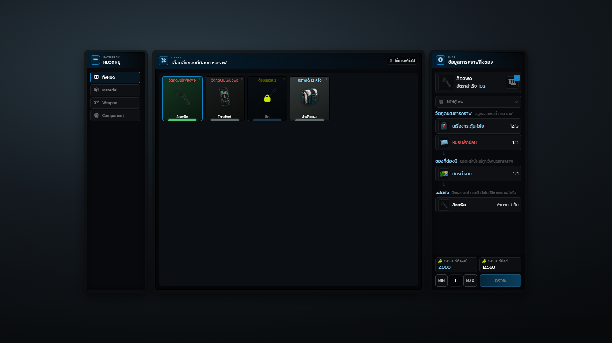
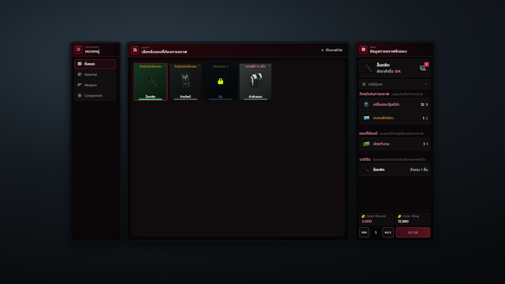
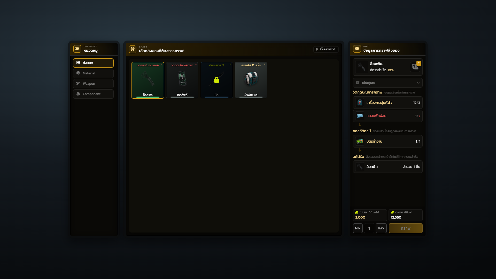
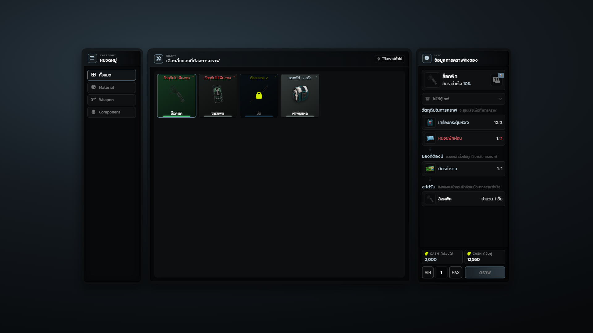

# ธีมสี

UI มีธีมสำเร็จรูป 7 ชุด เลือกด้วยบรรทัดเดียวใน `config/config.client.lua`

```lua
Config.Theme = 'seagreen'
```

ใส่ชื่อที่ไม่มีในรายการจะตกกลับไปใช้ `seagreen`



## ตารางสี

| ธีม | โทน | สี accent | สีหลัก | สีเน้น |
|---|---|---|---|---|
| `seagreen` | เขียวอมฟ้า (ค่าเริ่มต้น) | `#0aa388` | `#07705f` | `#16c7a6` |
| `ember` | ส้มอุ่น | `#d1561c` | `#8f3410` | `#ff7a3d` |
| `azure` | ฟ้าเย็น | `#1183c4` | `#0a4f7a` | `#35a8ee` |
| `violet` | ม่วง | `#7546c9` | `#4a2a86` | `#9a6ff0` |
| `crimson` | แดง | `#c22440` | `#7a1226` | `#f04a66` |
| `amber` | ทอง | `#d09a17` | `#8a6410` | `#f5bf3d` |
| `slate` | เทาอมฟ้า ไม่มีสีเด่น | `#5b7383` | `#35434c` | `#83a0b2` |

## ธีมเปลี่ยนอะไรบ้าง

**เปลี่ยนตามธีม**

* หัวหน้าต่างทุกบาน ไอคอนตราหัวหน้าต่าง และแถบไล่สีด้านหลัง
* ปุ่มคราฟ ปุ่มหมวดที่เลือกอยู่ แท็บวิธีคราฟที่เลือก
* เส้นขอบและเงาของการ์ดที่ถูกเลือก
* ตัวเลขและป้ายที่เป็นสีเน้น เช่น อัตราสำเร็จ หัวข้อในแผงข้อมูล
* สีพื้นของหน้าต่างและตัวเรือน (แต่ละธีมมีโทนดำของตัวเอง)

**ไม่เปลี่ยนตามธีม**

* สีความหายากของไอเทม — มาจาก `Hyper_Inventory` ทำให้ของชิ้นเดียวกันสีเดียวกันทุกที่ในเซิร์ฟ
* สีแดงเตือน (วัตถุดิบไม่พอ / เงินไม่พอ) — ยกเว้นธีม `crimson` ที่เปลี่ยนสีเตือนเป็นอำพันเพื่อไม่ให้ชนกับสีธีม
* สีเหลืองของแม่กุญแจและกล่องคำเตือนในการ์ดรายละเอียด
* วงแหวนเอฟเฟกต์ตอนคราฟ/อัปเกรด — ไล่ตามความหายากของไอเทม ไม่ใช่ตามธีม

## ภาพทีละธีม

### seagreen



### ember



### azure



### violet


### crimson



### amber



### slate



## เพิ่มธีมเอง

ธีมอยู่ใน `html/css/ui.css` แต่ละชุดประกาศแค่สีหลักเจ็ดสี ค่า rgb สามชุด และสีพื้น accent แบบหรี่สองสี token อื่นทั้งหมดคำนวณต่อจากค่าเหล่านี้เอง เพิ่มธีมใหม่จึงก๊อปบล็อกเดิมมาเปลี่ยนสี ไม่ต้องแก้ที่อื่น

```css
[data-theme="mytheme"] {
    --c-primary:     #...;
    --c-accent:      #...;
    --c-accent-hi:   #...;
    --c-accent-soft: #...;
    --c-accent-top:  #...;
    --c-surface:     #...;
    --c-danger:      #...;
    --c-accent-rgb:  .. .. ..;
    --c-danger-rgb:  .. .. ..;
    --c-surface-rgb: .. .. ..;
    --c-shell-rgb:   .. .. ..;
    --accent-deep:   #...;
    --accent-deeper: #...;
}
```

แล้วเพิ่มชื่อลงรายการธีมใน `html/js/app.js` ให้ระบบรู้จัก ไม่งั้นจะตกกลับไปใช้ `seagreen`
