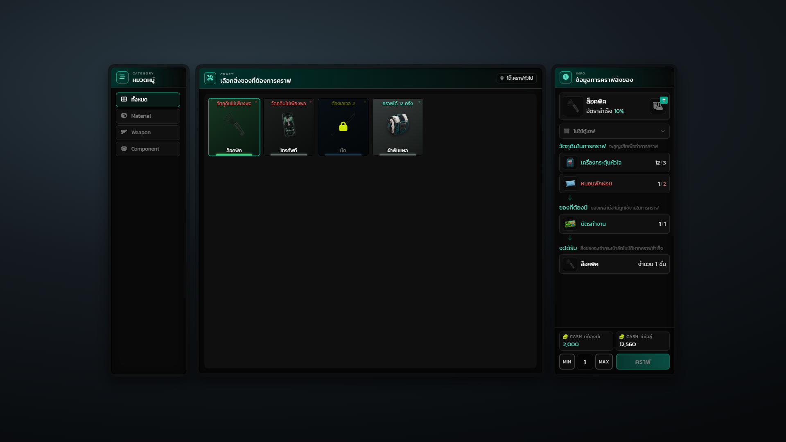
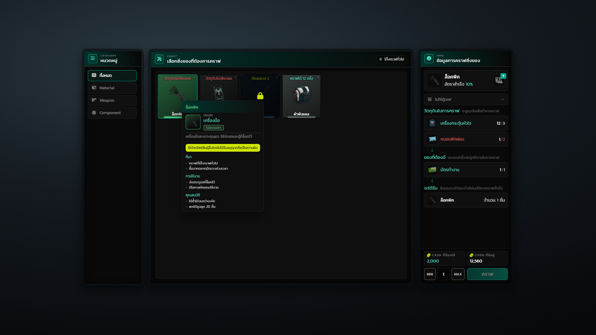
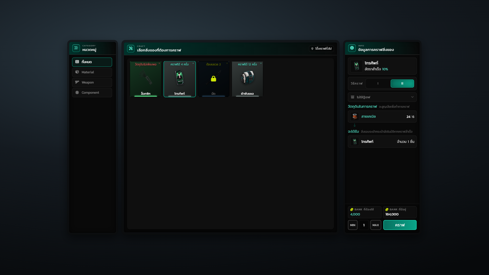
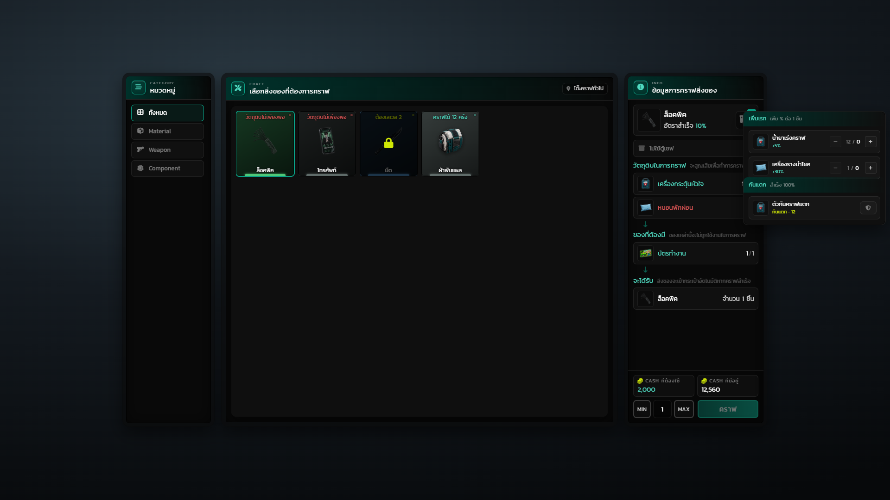
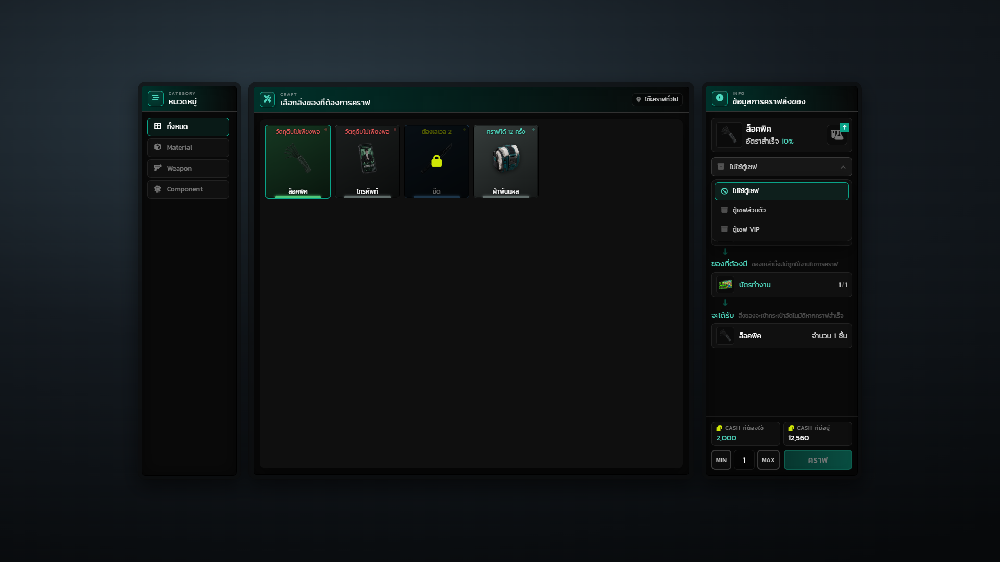
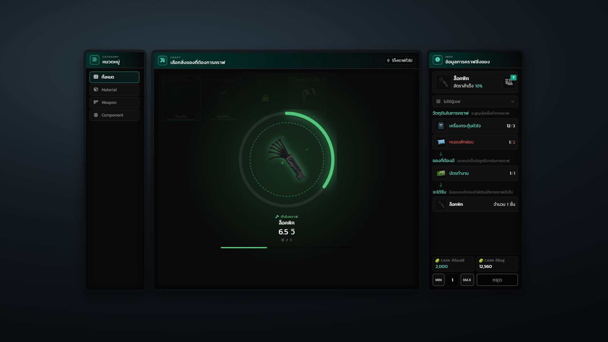
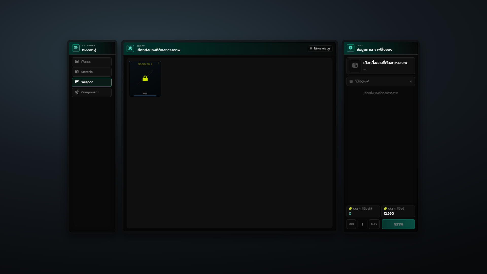
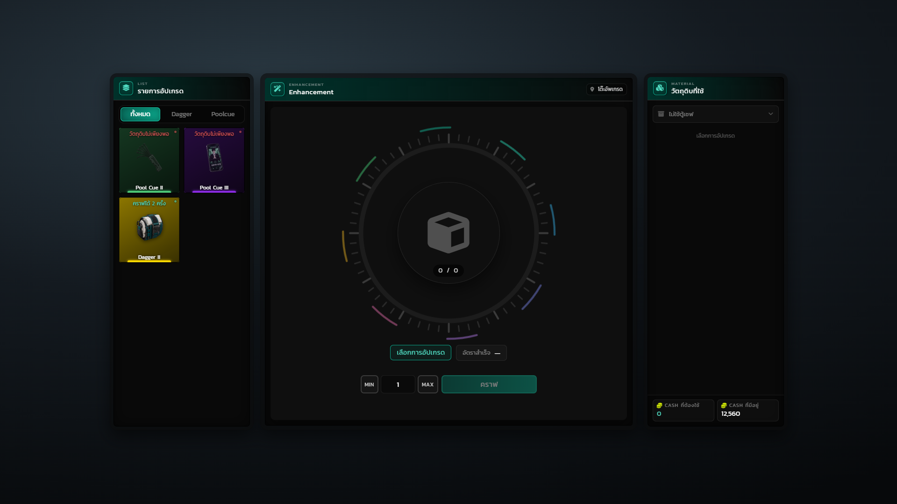
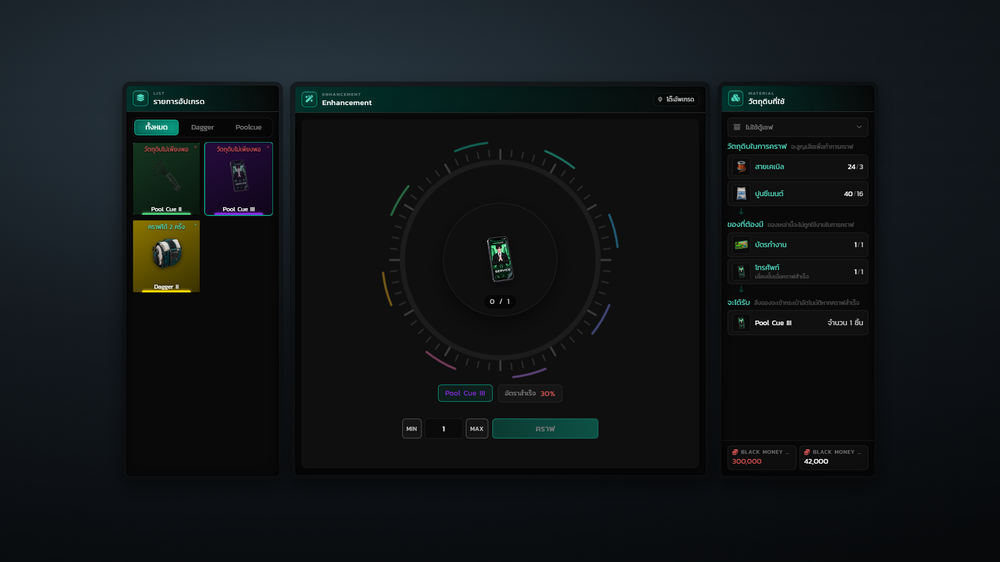
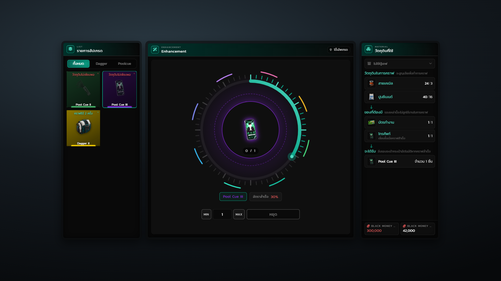

# หน้าจอ UI

ภาพทั้งหมดถ่ายจากโค้ด NUI จริงของ resource ด้วยข้อมูลจำลอง ธีมในภาพคือ `seagreen` (ค่าเริ่มต้น)

หน้าจอแบ่งเป็นหน้าต่างแยกกันวางเคียงข้าง ไม่ใช่กล่องเดียวแบ่งช่อง แต่ละหน้าต่างมีขอบและหัวของตัวเอง

## 1. เลือกสิ่งของที่ต้องการคราฟ

หน้าตั้งต้นของโต๊ะคราฟ สามหน้าต่าง — ซ้ายคือหมวดหมู่ กลางคือกริดสูตร ขวาคือข้อมูลการคราฟที่ยังว่างอยู่ การ์ดแต่ละใบบอกสถานะด้วยป้ายบนสุดและจุดกระพริบมุมขวา: คราฟได้กี่ครั้ง วัตถุดิบไม่พอ หรือยังไม่ถึงเลเวล

## 2. เลือกสูตรแล้ว

กดการ์ดแล้วหน้าต่างขวาเติมข้อมูลครบ — การ์ดหัวบอกไอเทมกับอัตราสำเร็จ ถัดลงมาเป็นวัตถุดิบที่จะหายไป ของที่ต้องมีแต่ไม่ถูกหัก และของที่จะได้รับ ตัวเลขทางขวาของแต่ละแถวคือ "มีอยู่ / ต้องใช้" แถวไหนไม่พอจะเป็นสีแดง ก้นหน้าต่างเป็นยอดเงินและปุ่มคราฟ

## 3. รายละเอียดไอเทม

ชี้ที่การ์ดแล้วได้การ์ดรายละเอียดชุดเดียวกับในกระเป๋า — แถบหัวไล่สีตามความหายาก รูป ประเภท ป้ายความหายาก คำอธิบาย แล้วตามด้วยบล็อกข้อมูลที่กระเป๋ากำหนดไว้ ทั้งคำเตือน ที่มา การใช้งาน และคุณสมบัติ

## 4. วิธีคราฟหลายทาง

สูตรที่ตั้ง `methods` ไว้จะมีแถบแท็บเลขโรมันโผล่ใต้การ์ดหัว ในภาพเลือกทาง II อยู่ วัตถุดิบและสกุลเงินด้านล่างเปลี่ยนตามทางที่เลือกทันที (ทาง II จ่ายด้วย Bank แทนเงินสด)

## 5. แผงไอเทมช่วยคราฟ

กดปุ่มมุมขวาบนของการ์ดหัวแล้วแผงจะไถออกมาข้างหน้าต่าง แบ่งสองส่วน — "เพิ่มเรท" ปรับจำนวนด้วยปุ่มลบ/บวก บอก % ที่เพิ่มต่อชิ้น และ "กันแตก" เป็นสวิตช์เปิดปิด ถ้าที่ว่างทางขวาไม่พอ แผงจะเลื่อนเข้ามาซ้อนหน้าต่างข้อมูลเล็กน้อยแทนที่จะหลุดขอบจอ

## 6. เลือกตู้เซฟ

ดรอปดาวน์เลือกว่าจะดึงวัตถุดิบจากตู้ไหนมาใช้ร่วมกับของในกระเป๋า ตู้ที่ผู้เล่นยังไม่มีจะขึ้นป้ายกำกับและกดไม่ได้

## 7. กำลังคราฟ

ระหว่างคราฟจะมีแผงขึ้นทับกริด — วงแหวนความคืบหน้าพร้อมรูปไอเทมตรงกลางที่เต้นเป็นจังหวะ มีวงประหมุนและประกายไฟ ใต้วงเป็นชื่อไอเทม เวลานับถอยหลัง จำนวนชิ้นที่เสร็จแล้ว และแถบความคืบหน้า สีทั้งแผงไล่ตามความหายากของไอเทมที่คราฟ ปุ่มคราฟเปลี่ยนเป็น "หยุด"

## 8. สูตรที่ยังล็อกอยู่

โต๊ะคราฟอาวุธเปิดเฉพาะหมวด Weapon สูตรที่เลเวลยังไม่ถึงจะมีแม่กุญแจคลุมและป้ายบอกเลเวลที่ต้องการ กดเลือกไม่ได้จนกว่าจะถึงเลเวล

## 9. โต๊ะอัปเกรด

หน้าอัปเกรดใช้สามหน้าต่างเหมือนกันแต่สลับหน้าที่ — ซ้ายเป็นรายการอัปเกรดพร้อมแท็บหมวด กลางเป็นวงแหวนใหญ่ ขวาเป็นวัตถุดิบ สีของการ์ดในรายการไล่ตามความหายากของของที่จะได้

## 10. เลือกรายการอัปเกรด

เลือกแล้วรูปของที่จะได้ไปอยู่กลางวงแหวน ใต้วงเป็นชื่อกับอัตราสำเร็จ หน้าต่างขวาแสดงวัตถุดิบที่หายไป ของที่ต้องมี (รวมของฐานที่จะเลื่อนขั้น) และของที่จะได้รับ

## 11. กำลังอัปเกรด

ระหว่างทำงาน วงแหวนเดินตามเวลาจริง กรอบนอกแปดเส้นสีหมุนวน และมีแสงฟุ้ง วงประหมุน กับประกายไฟเพิ่มเข้ามา — ทั้งหมดไล่สีตามความหายากของของที่จะได้ (ในภาพเป็นระดับเอปิก จึงเป็นสีม่วง)

## ที่ต้องแคปในเกมเอง

ส่วนที่เป็น native ของเกม ถ่ายจาก NUI ไม่ได้ ต้องแคปหน้าจอในเกมจริง:

* marker ลูกศรเหนือโต๊ะ
* prop โต๊ะที่ spawn ตามพิกัด
* Text UI "กด E เปิดโต๊ะคราฟ" ตอนเข้าใกล้ (มาจาก `Hyper_Notifyall`)
* กล่องแจ้งเตือนผลคราฟและข้อความประกาศทั้งเซิร์ฟ (มาจาก `Hyper_Notifyall`)
* ท่าทางตัวละครระหว่างคราฟ
